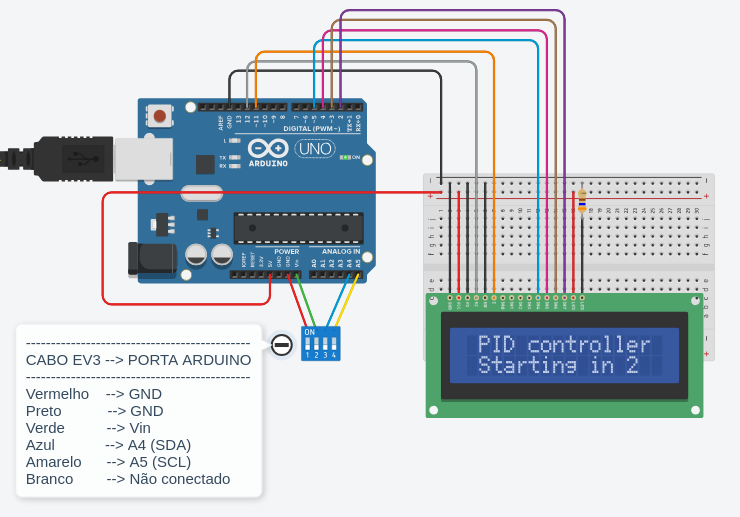
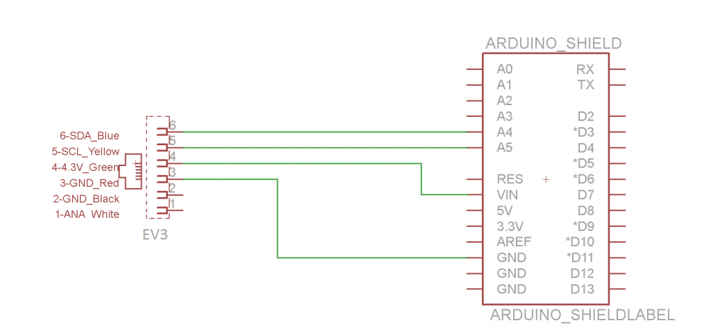
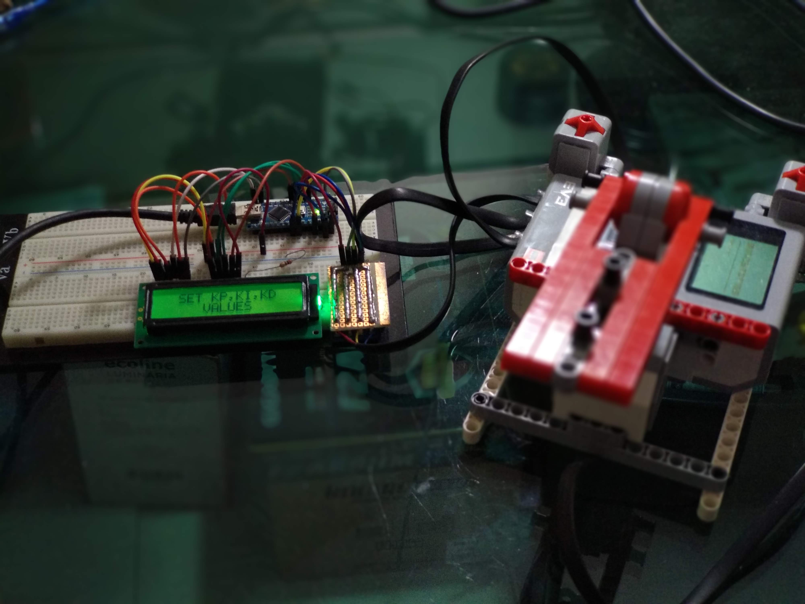

# PID Controller for EV3 with Arduino
---
Arduino PID controller for EV3
- PID Control on Arduino to control motors on Mindstorms EV3
- I2C protocol between Mindstorms EV3 and Arduino
---
## Introduction
This project is an project about Arduino (free hardware electronic prototyping platform) with Lego Mindstorms EV3 (programming platform for LEGO robot development) integration. The EV3 has the I2C communication interface, as well as the Arduino, thus enabling the integration of these platforms. In this project, the Arduino acts as a PID controller, in order to control the positioning of the axis of a motor, in which beams are coupled to support some object so that the axis is always balance itself in the desired position regardless of the mass of the object (respecting engine limitations).
## Hardware and software required

### Hardware
+ 1x Arduino (any version, in this project the Nano version was used);
+ 1x Lego Mindstorms EV3 + motor (with encoder feedback) + structure LEGO bricks + 2 buttons;
+ 1x Breadboard;
+ 1x LCD display 16x2;
+ 1x Board to build circuits;
+ 1x Electronic terminal with 4 inputs;
+ 1x Pin bar with 4 pins;

### Software
+ EV3 Mindstorms - Programming software;
+ Arduino IDE;
+ Arduino libraries: Wire, LiquidCrystal e PIDLibrary (Brett Beauregard) (available in this project);
+ I2C library for Mindstorms (available in this project);

## Schematics
### Arduino and LCD display connection schematic

The wires connected to A4 and A5 in Arduino are there in order to make the I2C connection to the EV3.
### I2C schematic

The image above shows the schematic about the connection between the Arduino and the EV3.

## Project pictures

## Documentation
Documentation available [here](documentation_pt-BR.pdf).
